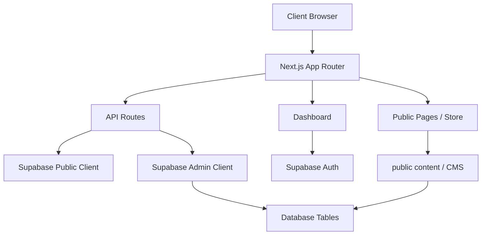

# تقرير التدقيق الشامل للمشروع — SODFA Store

## 1. ملخص تنفيذي

هذا التقرير هو مراجعة شاملة للمشروع الحالي، ويغطي:

- البنية التقنية والهيكل العام
- نقاط القوة
- نقاط الضعف
- المشاكل التقنية
- مشاكل الأمان والحماية
- نقاط الاستقرار والأداء
- الثغرات الأمنية المحتملة
- أولويات الإصلاح
- خطة تنفيذية قابلة للتنفيذ

النتيجة العامة: المشروع بناؤه كبير ومتنوع، وله قاعدة جيدة من المكونات، لكنه يحتاج إلى تنظيف أمني وهيكلي مهم قبل الإطلاق أو التوسع في الإنتاج. هناك عدد من المشاكل الخطيرة/الحرجة تتعلق بالحماية والـ auth، ووجود كود قديم، وطبقات مطابقة غير موحدة، وخطوط ضعيفة في إدخال البيانات والتحقق منها.

## 2. النطاق والتحليل

تم التحقق من الملفات والأجزاء التالية:

- [README.md](../README.md)
- [next.config.ts](../next.config.ts)
- [middleware.ts](../middleware.ts)
- [app/contexts/AuthContext.tsx](../app/contexts/AuthContext.tsx)
- [lib/supabase/config.ts](../lib/supabase/config.ts)
- [lib/supabase/server.ts](../lib/supabase/server.ts)
- [lib/supabase/admin.ts](../lib/supabase/admin.ts)
- [app/api/notifications/route.ts](../app/api/notifications/route.ts)
- [app/dashboard/layout.tsx](../app/dashboard/layout.tsx)
- [app/(auth)/login/page.tsx](../app/(auth)/login/page.tsx)
- [app/Resources/assets/js/app.js](../app/Resources/assets/js/app.js)
- [app/(store)/content/[slug]/page.tsx](../app/(store)/content/[slug]/page.tsx)
- [app/sections/Navbar/index.tsx](../app/sections/Navbar/index.tsx)
- [app/sections/Footer/index.tsx](../app/sections/Footer/index.tsx)

## 3. تقييم عام للمشروع

### 3.1 الحالة العامة

المشروع يجمع بين:

- Frontend Next.js App Router
- Dashboard داخل التطبيق
- Storefront public
- Supabase كقاعدة بيانات
- JWT/Auth من Supabase
- API Routes متعددة
- محتوى ديناميكي من قاعدة البيانات
- نظام تنبيهات ونظام محتوى وقوائم

### 3.2 نقاط القوة

1. بنية واضحة إلى حد كبير
   - separation بين Store / Dashboard / Auth
   - استخدام route groups منطقي
   - وجود عناصر API منظمّة

2. استخدام Supabase بشكل جيدا جزئيا
   - server/client separation موجود
   - admin client موجود بشكل منفصل
   - env config centralized

3. وجود dashboard مع قوالب ومكونات متعددة
   - من الممكن توسعة النظام بشكل جيد

4. نظام كلمات/محتوى/إعدادات منظم
   - توجد ملفات في lib و app/api و supabase/migrations

### 3.3 نقاط الضعف الأساسية

- وجود طبقات auth غير واضحة أو غير متسقة
- وجود مسار middleware لا يقوم بحماية حقيقية للمسارات المهمة
- استخدام service-role key في API معينة قد يفتح مساحات كبيرة إذا لم يتم التحقق من الصلاحيات جيداً
- عدم وجود rate limiting أو throttling في بعض نقاط الإدخال
- عدم وجود sanitization كافٍ للمحتوى HTML المرسَل من CMS/Content
- وجود كود قديم من مشروع سابق غير منظم في app/Resources/assets/js/app.js
- وجود console logs في بيئة الإنتاج
- بعض الملفات تستخدم user-controlled data مباشرة في innerHTML / dangerouslySetInnerHTML

## 4. مخطط العمارة العام

## 5. المشاكل التقنية والهيكلية

### 5.1 Middleware لا يحمي فعليا المسارات المهمة

ملف: [middleware.ts](../middleware.ts)

المشكلة:

- PROTECTED_PATHS فارغ
- في الواقع لا توجد حماية فعّالة للدashboard أو api/admin
- التعليق يوضح أن الحماية تتم في client-side فقط، وهذا لا يكفي
- هذا يترك نظاماً هشاً إذا فقدنا client-side validation أو إذا تم الوصول إلى routes بشكل مباشر

النتيجة:

- أي مستخدم يمكنه محاولة الوصول إلى مسارات حساسة
- الاعتماد على client side وحده لا يفي بمتطلبات الأمان

الحل المقترح:

- حماية حقيقية في middleware
- التحقق من cookies/session أو token من Supabase
- whitelist للـ public routes فقط
- استخدام مسارات محددة مثل /dashboard, /api/admin, /api/orders, /api/products

### 5.2 لا يوجد تمييز حقيقي بين public client و admin client

ملفات:

- [lib/supabase/server.ts](../lib/supabase/server.ts)
- [lib/supabase/admin.ts](../lib/supabase/admin.ts)

المشكلة:

- هناك فصل بين client و admin، لكنه في الواقع مستخدم بشكل واسع في ملفات API public
- بعض ملفات API تستخدم admin client بشكل مباشر للعمليات العامة، بما في ذلك محتوى عام/مفتوح، وهذا يزيد مساحة الهجوم

ما الذي يجب أن يكون صحيحاً:

- public routes تستخدم public anon client فقط
- admin routes تستخدم admin client فقط داخل server-side routes محمية
- لا يجب أن توجد routes public تستعمل service role إلا إذا كانت مقصودة ومحصّنة

### 5.3 التحقق من المتغيرات البيئية يعتمد على قيم placeholder / dummy

ملف: [lib/supabase/config.ts](../lib/supabase/config.ts)

المشكلة:

- schema يستخدم قيم mock/placeholder في رسالة الخطأ، وليس في الواقع قيمة حقيقية
- هذا يربك التصحيح عند وجود مشاكل في env
- إذا كانت القيم مفقودة، يحاول النظام التوقف بشكل مبهم ولا يوضح ما الذي يجب فعله

الحل المقترح:

- إظهار رسالة واضحة جدًا عند فشل env
- منع التطبيق من التشغيل إذا كانت المتغيرات اللازمة مفقودة في production
- التحقق من وجود SUPABASE_SERVICE_ROLE_KEY في production فقط، وليس في client

### 5.4 بعض API routes تعتمد على خدمة عامة بدون التحقق من Auth

ملفات مثل:

- [app/api/notifications/route.ts](../app/api/notifications/route.ts)
- [app/api/contact/route.ts](../app/api/contact/route.ts)
- [app/api/checkout/route.ts](../app/api/checkout/route.ts)
- [app/api/products/route.ts](../app/api/products/route.ts)

المشكلة:

- يتم إنشاء admin client مباشرة في بعض الـ routes
- لا يوجد في التقرير الحالي ما يثبت عدم وجود auth، لكن الوجود الواسع لـ admin client داخل public-facing routes يخلق خطر التلاعب غير المصرح به

الحل المقترح:

- كل route mutation أو write operation يجب التحقق من صلاحية المستخدم
- استخدام service role فقط داخل routes admin أو cron أو maintenance
- لا تجعل notification public POST بواجهة عامة بدون rate limiting و CAPTCHA/CSRF/secret guard

## 6. مشاكل الأمان والحماية

### 6.1 XSS عبر dangerouslySetInnerHTML

ملفات:

- [app/(store)/content/[slug]/page.tsx](../app/(store)/content/[slug]/page.tsx)
- [app/dashboard/pages/store-manager/store-content/components/ContentEditor.tsx](../app/dashboard/pages/store-manager/store-content/components/ContentEditor.tsx)
- [app/sections/AboutSection/index.tsx](../app/sections/AboutSection/index.tsx)
- [app/sections/common/LegalModal.tsx](../app/sections/common/LegalModal.tsx)

المشكلة:

- محتوى HTML يتم عرضه مباشرة داخل التطبيق
- إذا كان المحتوى مصدره CMS أو DB أو إدخال مستخدم، فهذا يفتح باب XSS
- لا توجد تصفية أو sanitization واضحة

الحل المقترح:

- استخدام sanitizer مثل DOMPurify
- منع HTML من إدخالات المستخدم إلا في حالات معينة
-حدّ الأذونات على محتوى CMS، وتقييد الأنماط/الروابط/الـ iframes

### 6.2 محتوى HTML في صفحات content_pages قد يكون غير موثوق

ملف: [supabase/migrations/016_content_pages_public_read.sql](../supabase/migrations/016_content_pages_public_read.sql)

المشكلة:

- SQL يسمح للـ public بالقراءة من content_pages
- هذا مناسب للصفحات العامة، لكن محتوى هذه الصفحات قد يحتوي على HTML غير مُفلتر

الحل المقترح:

- تقييد التعديل للمستخدمين المصرح لهم فقط
- sanitization لكل محتوى page قبل عرض الصفحة
- segregate public CMS content from admin content

### 6.3 استخدام localStorage و sessionStorage في سياق auth لا يعتبر حماية

ملفات:

- [app/contexts/AuthContext.tsx](../app/contexts/AuthContext.tsx)
- [app/dashboard/layout.tsx](../app/dashboard/layout.tsx)
- [app/dashboard/components/layout/Header.tsx](../app/dashboard/components/layout/Header.tsx)

المشكلة:

- هذا المشروع يعتمد على Supabase auth بشكل جزئي، لكن بعض أجزاء التطبيق تستخدم session/local storage كإشارات بديلة
- في بيئة الإنتاج، هذا يمكن أن يكون غير كافٍ إذا لم يتم التحقق بشكل كامل على الخادم

الحل المقترح:

- استخدم session-based auth بشكل موحد
- لا تعتمد على التحقق من client فقط
- اسمح فقط بعبور البيانات المتاحة عبر server-side validation

### 6.4 ضغط/تأمين الـ API غير موجود في الكثير من الملفات

أنواع المشاكل:

- عدم وجود rate limiting
- عدم وجود validation صارم لكل payload
- عدم وجود audit log للطلبات الحساسة
- عدم وجود ملفات allowlist/denylist للـ resources

## 7. المشاكل التقنية والبرمجية

### 7.1 مشروع قديم داخل app/Resources/assets/js/app.js

ملف: [app/Resources/assets/js/app.js](../app/Resources/assets/js/app.js)

المشكلة:

- هذا الملف يبدو أنه جزء موروث من كود JavaScript قديم
- يحوي innerHTML و console.log و منطق UI مخزن بكامل الملف
- يخلق صعوبة في الصيانة والاختبار

الأثر:

- صعوبة في العناية بالـ frontend
- خطر تداخل الأنماط والـ DOM manipulation
- صعوبة في debug

الحل المقترح:

- نقل المنطق إلى تطبيق React/Next moderno
- إزالة أو إيقاف أي كود legacy لا يستخدم في الإنتاج
- إيقاف هذا الملف إذا لم يعد مستخدماً

### 7.2 هناك كود debug/console logging في الإنتاج

مواقع متعددة، مثال:

- [app/(auth)/login/page.tsx](../app/(auth)/login/page.tsx)
- [app/dashboard/pages/store-manager/homepage/services/homepageService.ts](../app/dashboard/pages/store-manager/homepage/services/homepageService.ts)
- [app/Resources/assets/js/app.js](../app/Resources/assets/js/app.js)

المشكلة:

- console.log في الإنتاج يفضح معلومات حساسة
- في بعض الحالات قد يذكر usernames, emails, failed login reasons

الحل:

- إزالة logs من الإنتاج أو تقييدها وفق environment
- استخدام logger مع مستويات مختلفة

### 7.3 قوالب الصور والـ assets ليست موحدة

ملفات:

- [app/sections/Navbar/index.tsx](../app/sections/Navbar/index.tsx)
- [app/sections/Footer/index.tsx](../app/sections/Footer/index.tsx)
- [public/assets](../public/assets)

المشكلة:

- هناك عدة مسارات للـ logo و footer image
- لا يوجد مصدر موحد للـ brand configuration

الحل المقترح:

- إنشاء central site configuration single source of truth
- إزالة image URLs المتفرقة

### 7.4 القيم والأرقام الحاسمة غالباً ما تكون hardcoded

المثال: free shipping threshold وغيرها

المشكلة:

- في بعض الحالات، توجد قيمة داخل UI أو logic مباشرة، وليس في مصدر بيانات موحد
- يؤدي هذا إلى حالات قديمة أو inconsistent state

الحل:

- جرّب اعتماد مصدر واحد فقط (settings table / API)
- لا تجعل القيمة موجودة في أكثر من مكان

## 8. مشاكل قاعدة البيانات والأمان في SQL

### 8.1 RLS policy public reads متاحة لكن محتوى CMS غير مُفلتر

ملف: [supabase/migrations/016_content_pages_public_read.sql](../supabase/migrations/016_content_pages_public_read.sql)

المشكلة:

- السماح بالقراءة العامة لصفحات محتوى معينة قد يكون مناسباً
- لكن من دون sanitization أو validation، يمكن أن يصبح هذا نقطة XSS

### 8.2 الجداول والحقول تحتاج إلى schema audit شامل

المشروع يحتوي على SQL ومشاريع كثيرة، لكن يوجد ضغط في:

- إضافة أعمدة على الجداول القديمة
- تغيّر في schema أثناء التطوير
- عدم وجود اعتمادية كاملة على migrations versioning

الحل المقترح:

- تفريغ كامل لكل schema
- التوثيق لكل جدول وحقل
- إضافة migrations checks

## 9. مشاكل الأداء والـ UX

### 9.1 هناك كود قديم وخطير في app/Resources/assets/js/app.js

- يستخدم DOM repaint بشكل واسع
- غير مناسب ل modern Next.js
- يمكن إبطاء الصفحة

### 9.2 بعض الصفحات تعتمد على fetchات أو كنتاكات متعددة مع عدم وجود loading/error boundaries مناسبة

المشكلة:

- تجربة المستخدم قد تتعطل عندما تفشل fetchات أو endpoints

### 9.3 بعض الرسوم المتحركة/الواجهة تم إنشاؤها بشكل غير منتظم

- بعض المكونات مطبقة في React
- وبعضها من scripts legacy
- causes visual inconsistency

## 10. قائمة المشاكل الحرجة حسب الأولوية

### P0 - Critical

1. Middleware لا يحمّي المسارات الحساسة
2. public content HTML قد يسمح بـ XSS
3. public APIs تستخدم admin client في بيئات عامة بدون tx checks
4. بعض endpoints ليست محمية أو بها validation ضعيف

### P1 - High

1. Console logs في الإنتاج
2. Legacy JS app.js threatens maintainability
3. inconsistent auth state and session handling
4. no rate limiting / abuse protection

### P2 - Medium

1. Hardcoded values in UI
2. inconsistent site configuration
3. legacy asset management
4. lack of data validation for CMS content

### P3 - Low

1. visual inconsistency
2. duplicated patterns
3. missing documentation for schema and feature ownership

## 11. خطة الإصلاح المقترحة

### المرحلة 1: الأمن الأساسي

- تطبيق حماية حقيقية في middleware
- تحديد public vs protected routes بشكل واضح
- تأكد من أن dashboard و API admin محمية
- منع الوصول إلى routes بدون auth

### المرحلة 2: حماية المحتوى

- install sanitization library
- sanitize all CMS and content_pages HTML
- whitelist allowed tags/attributes
- reject dangerous URLs

### المرحلة 3: Clean Architecture

- إزالة أو إيقاف legacy app.js
- نقل كل منطق UI إلى React/Next moderno
- إعادة تنظيم API routes

### المرحلة 4: DevEx & Stability

- إزالة console logs
- إضافة logging structure
- mejorar validation و retry/error handling
- add rate limiting

### المرحلة 5: Documentation & Governance

- توثيق كل جدول وأثره
- توثيق كل API route
- توثيق auth and permissions
- توثيق كل عميل Supabase وميزته

## 12. جدول القيم والملفات المهمة

| الفئة | الحالة | الأثر | الأولوية |
|---|---|---:|---:|
| Auth protection | Weak | High | P0 |
| XSS risk | High | High | P0 |
| Legacy JS | High | Medium | P1 |
| API validation | Medium | High | P1 |
| Config quality | Medium | Medium | P1 |
| Content sanitization | High | High | P0 |
| Schema documentation | Weak | Medium | P2 |
| Logger hygiene | Medium | Low | P2 |

## 13. الخلاصة النهائية

المشروع في مرحلة متقدمة من التطوير، لكنه لا يزال يحتاج إلى:

- حماية حقيقية أقوى
- توحيد auth والـ routing
- تصفية محتوى HTML
- إزالة الكود القديم
- توثيق أكثر دقة
- نظام API/DB أكثر أماناً

إذا تم تنفيذ الإصلاحات المذكورة أعلاه بشكل صحيح، فسيصبح المشروع أكثر استقراراً، أكثر أماناً، وأقل عرضة للأخطاء التشغيلية أو الثغرات الأمنية.

## 14. قائمة التوصيات السريعة

1. قم بإصلاح middleware للتأكد من حماية /dashboard و /api/admin
2. امنع HTML غير معالج من public content
3. استخدم sanitizer لجميع بيانات CMS
4. أوقف app/Resources/assets/js/app.js إذا لم تعد مطلوبة
5. أزل console logs من الإنتاج
6. أضف validation و rate limiting كطبقة أساسية في كل route
7. اعتمد نظام auth واحد موحد على الخادم
8. وثق schema والحقول والأدوار

## 15. ملاحظات إضافية

هذا التقرير تم بناءه على تحليل الملفات الحالية وملامح المشروع، وليس على جلسات تشغيلية كاملة. لذلك بعض النقاط تعتبر "مشتبه بها أو تحتاج تأكيداً" في بعض الحالات، خاصة في أجزاء API و auth. يوصى بالتحقق الفعلي من السلوك في بيئة staging قبل الإصلاح النهائي.

## 16. ملحق: نقطة البداية الفعلية

أكثر الملفات التي يجب التعامل معها أولاً:

- [middleware.ts](../middleware.ts)
- [lib/supabase/config.ts](../lib/supabase/config.ts)
- [lib/supabase/admin.ts](../lib/supabase/admin.ts)
- [app/api/notifications/route.ts](../app/api/notifications/route.ts)
- [app/(store)/content/[slug]/page.tsx](../app/(store)/content/[slug]/page.tsx)
- [app/dashboard/layout.tsx](../app/dashboard/layout.tsx)
- [app/Resources/assets/js/app.js](../app/Resources/assets/js/app.js)

---

تم إنشاء هذا التقرير داخل المشروع في:

[docs/PROJECT_AUDIT_REPORT.md](PROJECT_AUDIT_REPORT.md)
